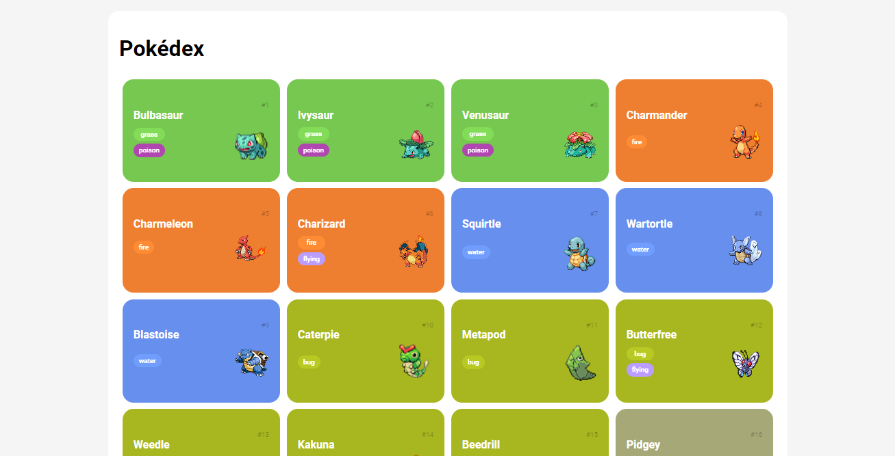

# Pokédex

Este é um projeto de Pokédex que utiliza a API do PokéAPI para listar e exibir detalhes dos Pokémon. Foi desenvolvido durante um bootcamp da Digital Innovation One (DIO).



## Estrutura do Projeto

```
src/
    css/
        global.css
        pokedex.css
    js/
        main.js
        poke-api.js
        pokemon-model.js
image.png
index.html
README.md
```

### Arquivos e Pastas

- `assets/css/global.css`: Contém estilos globais para o projeto.
- `assets/css/pokedex.css`: Contém estilos específicos para a Pokédex.
- `assets/js/main.js`: Contém a lógica principal para carregar e exibir os Pokémon.
- `assets/js/poke-api.js`: Contém funções para interagir com a PokéAPI.
- `assets/js/pokemon-model.js`: Define a classe `Pokemon`.
- `index.html`: Arquivo HTML principal que estrutura a página da Pokédex.

## Funcionalidades

- Listar Pokémon com detalhes como número, nome, tipos e imagem.
- Carregar mais Pokémon ao clicar no botão "Load More".

## Como Executar

1. Clone o repositório:
    ```sh
    git clone <URL_DO_REPOSITORIO>
    ```

2. Abra o arquivo `index.html` em um navegador web.

## Dependências

- [Normalize CSS](https://cdnjs.cloudflare.com/ajax/libs/normalize/8.0.1/normalize.min.css): Para normalizar estilos entre diferentes navegadores.
- [Google Fonts - Roboto](https://fonts.googleapis.com/css2?family=Roboto): Fonte utilizada no projeto.

## Estrutura do Código

### `assets/js/poke-api.js`

Contém funções para interagir com a PokéAPI:

- `pokeApi.getPokemonDetail(pokemon)`: Busca detalhes de um Pokémon específico.
- `pokeApi.getPokemons(offset, limit)`: Busca uma lista de Pokémon com base no offset e limite.

### `assets/js/main.js`

Contém a lógica para carregar e exibir os Pokémon na página:

- `loadPokemonItems(offset, limit)`: Carrega e exibe os Pokémon na lista.

### `assets/js/pokemon-model.js`

Define a classe `Pokemon` com as propriedades:

- `number`
- `name`
- `type`
- `types`
- `photo`

## Estilos

### `assets/css/global.css`

Define estilos globais para o projeto, como fonte, padding e margin.

### `assets/css/pokedex.css`

Define estilos específicos para a Pokédex, incluindo layout de grid, cores de fundo para diferentes tipos de Pokémon e estilos responsivos.

## Créditos

Este projeto foi desenvolvido como parte de um exercício de programação. As imagens e informações utilizadas são de propriedade de seus respectivos donos.

## Licença

Este projeto é de uso livre para fins educacionais e não comerciais.